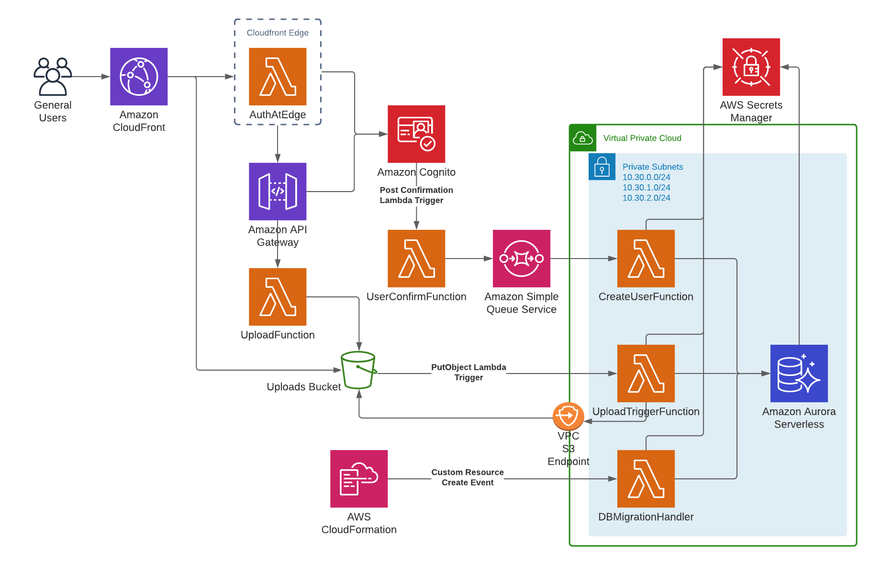

# Fil - Microbial File Storage Architecture Description


This document provide more details on the architecture of the deployed stack. The idea behind the application was to provision an entire application through a single command. I have never been a fan of clicking my way through the AWS console and then trying to remember what resources I created where and with what name. As such [CloudFormation](https://aws.amazon.com/cloudformation/) seemed like the obvious choice. In the end, I decide to use [AWS SAM](https://aws.amazon.com/serverless/sam/) as has some inbuilt resources to make things easier, while still being able to use regular CloudFormation resources when needed.

I did a lot of research trying to build this stack, and what I found was that there were online resources describing how to do certain parts, but very few that covered anything remotely complex. The few resources that had entire stacks ready to deploy usually lacked details on how they were implemented, assuming a lot of prior knowledge. This document attempts to bridge that gap and hopefully can provide some clarity over design choices and how things fit together.

## The Stack
The application consists of one main stack containing a nested stack. The nested stack, named __Database__, contains the resources required for setting up an RDS instance with [Aurora Serverless](https://aws.amazon.com/rds/aurora/serverless/) MySQL instance. That includes a Virtual Private Cloud containing three private subnets. The private subnets are identical in nature and could probably be reduced, but for this exercise I decided to stick with that amount. The Database stack also contains the AWS Secrets Manager containing the database credentials. It also contains a custom resource for creating the database tables on first stack creation.

The main stack contains the CloudFront distribution and the API Gateway. CloudFront requires authentication for all `/{Stage}/api` routes, where `Stage` is the parameter provided when the stack was deployed. Authentication is done at edge, meaning unauthenticated requests does not even enter the main application and is being done in CloudFront as a `viewer-request`. I wanted to ensure that the only entry-point to the API Gateway was through CloudFront. Thus I make use of an API key between CloudFront and the API Gateway. There are most likely other ways of achieving this, however this is working fairly well for this use case as guessing a 20 character API would take a not insignificant amount of time. If the API wey was to become publicly available, the API Gateway still uses auth, so an unauthenticated user would not be able to access any API resources anyway without an account. 
## Database
The database is an Aurora Serverless MySQL instance containing two database tables:

```sql
# users table
CREATE TABLE IF NOT EXISTS users (
  id int(10) unsigned NOT NULL AUTO_INCREMENT PRIMARY KEY,
  sub VARCHAR (255) NOT NULL UNIQUE,
  email TEXT NOT NULL,
  created_at DATETIME DEFAULT CURRENT_TIMESTAMP,
  INDEX users_sub_index (sub),
  INDEX users_email_index (email(255))
);

# uploads table
CREATE TABLE IF NOT EXISTS uploads (
  id int(10) unsigned NOT NULL AUTO_INCREMENT PRIMARY KEY,
  object_key VARCHAR(255) NOT NULL UNIQUE,
  name VARCHAR(255) NOT NULL,
  user_id int(10) unsigned NOT NULL,
  created_at DATETIME DEFAULT CURRENT_TIMESTAMP,
  CONSTRAINT uploads_user_id_foreign FOREIGN KEY (user_id) REFERENCES users (id)
);
```

## Limitations
The Aurora Serverless instance is set to go to sleep every 15 minutes. The application is using asynchronous events, so this will not be as noticeable for an end user, but it is something to keep in mind as the warm-up time is quite significant (30 seconds or more). This is also good to be mindful of when querying the database, either through the AWS CLI or through the AWS Management Console, as initial connection attempts tend to time out. 

Currently there are no rotations of secrets for either the database or for the API key. That is a good area for future improvement to improve security.

This stack needs to be deployed in `us-east-1`. The reason for that is because that is currently the only region where [Lambda@Edge](https://aws.amazon.com/lambda/edge/) is supported. Even though Lambda@Edge is only supported to be deployed in `us-east-1`, it will be deployed in every region. Being able to deploy Lambda@Edge from another region is possible, however it adds added complexity so currently only `us-east-1` is supported. 

The application would benefit from a frontend so that files could be uploaded easier. It could also benefit from having a `GET` endpoint for retrieving all uploads for an authenticated user. 

Pull requests are most welcome for any of these issues, or for other features that you think the application could benefit from (see [CONTRIBUTING](CONTRIBUTING.md) for details).