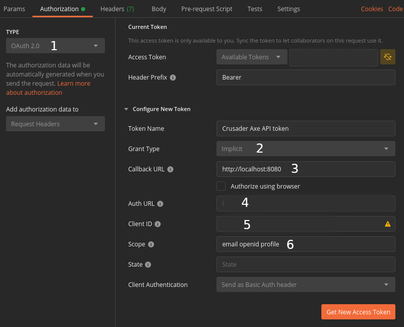

# Fil - Microbial File Storage


## What is this?
This is a CloudFormation Stack provisioned with [AWS SAM](https://aws.amazon.com/serverless/sam/) to create an application where a user can upload a file and then make it available on a public URL through CloudFront CDN. This was an exercise in trying to provision an entire application through code and being able to deploy it through a single command.

A detailed explanation of the cloud architecture for this stack can be found in [ARCHITECTURE](ARCHITECTURE.md).

## What's up with the name?
The picture at the top of this is [Fil](https://en.wikipedia.org/wiki/Viili) (or Viili in Finnish). It's a fermented, cultured milk product popular in Finland that's supposed to be really good for you. I can't stand it. Fil also means File in Swedish, hence the name. The __microbial__ part of the name was chosen mainly due to functionality of the app being small in scope, like a microbe 🦠.

## Installation
To build and deploy this application the SAM CLI will need to be installed. Installation instructions can be found [here](https://docs.aws.amazon.com/serverless-application-model/latest/developerguide/serverless-sam-cli-install.html). It also assumes that `yarn` is installed on the system.

## Deploy
```bash
yarn deploy --guided
```

`yarn deploy` will run `sam build` and `sam deploy`. 

`--guided` is needed at first deployment. The option will give you the option to provide values to stack parameters:
| Parameter   | Description | Restrictions | Default |
| ----------- | ------------| ------- | ------------ |
| Stage       | The Stage to use for the API Gateway | | test |
| ApiKeyValue | API key to use for communicating between CloudFront and API Gateway | Min 20 chars | 
| DBMasterUserName | Database admin user name | Between 1 and 16 chars alphanumeric, and underscore | admin_user |

After initial deployment the parameters specified will be stored in a `samconfig.toml` file that will be generated. Future deployments can simply be executed through `yarn deploy` unless some parameter needs to change. Changing a parameter can either be done by executing the deploy command with `--guided` again, or by modifying the parameters in the `samconfig.toml` file.

### Deployment overview
This will deploy a CloudFormation stack. At a high level overview the stack contains:
- Cloudfront Distribution
- Lambda@Edge for authentication
- API Gateway
- SQS Queue
- S3 Bucket
- Cognito User Pool and Client
- Lambda triggered on user sign-up post confirmation (`UserConfirmFunction`)
- Lambda triggered on SQS message to insert user into DB (`CreateUserFunction`)
- Lambda for uploading files to S3 (`UploadFunction`)
- Lambda triggered when file is uploaded to S3 (`UploadTriggerFunction`)
- Nested database stack
  - VPC with three private subnets
  - RDS Cluster for Aurora Serverless
  - Custom resource to create the database tables on stack creation
  - VPC endpoint with route table to allow access to S3

More details can be found in [ARCHITECTURE](ARCHITECTURE.md). Also refer to [template.yml](template.yml) and [database.template.yml](database.template.yml) for all the resources that will be deployed.

## Building
`sam build` will execute the make use of the `Makefile` to build the lambda functions and transpile them into Javascript. The build result is put in the `.aws-sam` directory which is then used for the `sam deploy` command. It also builds a runtime dependency layer in which all non-edge and non-custom resource lambdas utilise. [Lambda@Edge](https://docs.aws.amazon.com/AmazonCloudFront/latest/DeveloperGuide/lambda-requirements-limits.html#lambda-requirements-lambda-function-configuration) currently does not support layers. Layers are not used for the custom resource to avoid dependency inversion between the stacks.

If desired, only a single lambda function can be built. Simply specify which lambda function to build with the `sam build` command, using the name from the AWS SAM template. 

```bash
# Example

sam build UploadFunction
```

## Testing
```bash
yarn test
```
Runs the tests in the `__tests__` directory using Jest.

## Basic usage
```yaml
openapi: 3.0.3

servers:
  - url: https://cfdistribution.com/test/api
paths:
  /uploads:
    post:
      summary: Upload a file
      operationId: uploadFile
      description: Upload a file to make it publicly available through Cloudfront
      requestBody:
        content:
          multipart/form-data:
            schema:
              type: object
              properties:
                name:
                  type: string
                  description: Custom file name
                  example: my-file
                file:
                  type: string
                  format: binary
              required:
                - file
      responses:
        '201': 
          description: File uploaded successfully
          content:
            application/json:
            schema:
              type: object
              properties:
                url:
                  type: string
                  description: URL to uploaded file
                  example: https://cfdistribution.com/7fbf0a92-14e6-4fb8-bf80-698b3ac1af6f
```
The application only has a single endpoint, which is a post endpoint that allows `multipart/form-data` uploads of a file. The endpoint requires authentication, but viewing/downloading the file does not require any authentication. The application does not have a frontend, so it's easiest to run it through Postman.

### How to use with Postman
To be able to execute an upload through postman we first need to get an access token from Cognito. 

#### Authentication


The following steps describes how to get an access token that can be used for authenticating with the API.

1. Make sure the auth type is __OAuth 2.0__
2. Set Grant Type to __Implicit__
3. Enter the cloudfront distribution URL as the Callback URL. Can be found in the stack outputs section as `CFDistribution`.
4. Enter the Auth URL. Can be found in the stack outputs section as `AuthURL`. 
5. Can be found in the stack outputs section as `ClientID`.
6. Add email, openid and profile as Scope.

With these details in place we can get a new access token. Sign-up by entering your email and a password of your choosing. You will receive a confirmation message to your email which contains a set of numbers that will need to be added. For subsequent attempts to get access token you can simply login with your email and password.

#### Uploading a file
The url to use is in the following format:
```
https://abcdefgh123.cloudfront.net/test/api/uploads
```
Replace with your actual CloudFront distribution url. __/test__ is the `Stage` you specified as the parameter when you deployed your stack. The default is `test`. Execute a post request with an optional `name` and a file with field name `file` and you should get a response back

```json
{
  "url": "https://cfdistribution.com/7fbf0a92-14e6-4fb8-bf80-698b3ac1af6f"
}
```
If you navigate to the response URL you should be able to download the file you just uploaded 🤩.

## Costs 💸
Deploying this stack will incur costs even if you are on [AWS Free Usage Tier](http://aws.amazon.com/free). It will cost you about $0.95 per day. The vast majority of the cost is the cost for running a VPC and a small part of it is for the RDS instance.